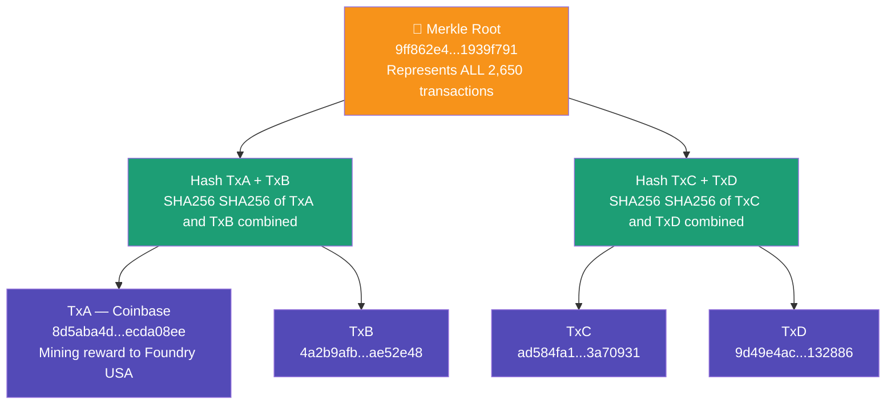

# Task 2: Merkle Tree Visualization
## Bitcoin Block 948,362

---

## The 4 Transactions Used

I used the first 4 real transaction hashes from Block 948,362:

| Label | Transaction ID |
|-------|---------------|
| TxA (Coinbase) | 8d5aba4db120f7c9dc586f4cc9125f9bd490d0a5cd97c4429007d849ecda08ee |
| TxB | 4a2b9afb30627d910b47b9c01e7c3fe760387aba6a699f36238092cd5ae52e48 |
| TxC | ad584fa10b96946b30af9d42a9e999aa83a3305b74a6ffc8dd64030173a70931 |
| TxD | 9d49e4aca797c31554051273029cf06cc292929e9bee9555df35cc134f132886 |

---

## Merkle Tree Diagram



---

## Step by Step Calculation

**Step 1: The 4 transaction hashes are the leaves of the tree**
```
TxA = 8d5aba4db120f7c9dc586f4cc9125f9bd490d0a5cd97c4429007d849ecda08ee
TxB = 4a2b9afb30627d910b47b9c01e7c3fe760387aba6a699f36238092cd5ae52e48
TxC = ad584fa10b96946b30af9d42a9e999aa83a3305b74a6ffc8dd64030173a70931
TxD = 9d49e4aca797c31554051273029cf06cc292929e9bee9555df35cc134f132886
```

**Step 2: Hash the first pair TxA and TxB**
```
Hash(AB) = SHA256(SHA256(TxA + TxB))
```
TxA and TxB are concatenated (joined together) then hashed twice with SHA256.
This produces one single hash representing both transactions.

**Step 3: Hash the second pair TxC and TxD**
```
Hash(CD) = SHA256(SHA256(TxC + TxD))
```
Same process for TxC and TxD producing one hash for both.

**Step 4: Hash the two results to get the Merkle Root**
```
Merkle Root = SHA256(SHA256(Hash(AB) + Hash(CD)))
```

**Final Result**
```
Merkle Root = 9ff862e464b708f70ba9016b90d94ed8ab33ce8b9453cabdaf7f7dfa1939f791
```
This matches exactly the Merkle root recorded in Block 948,362 on the
Bitcoin blockchain confirming our calculation is correct.

---

## Why Merkle Trees Matter

**Efficiency**
Bitcoin blocks can contain thousands of transactions. Instead of storing all
transaction hashes in the block header Bitcoin condenses them all into one
single 32-byte Merkle root. This keeps the block header small and compact.

**Tamper Detection**
If anyone changes even one transaction the hash of that transaction changes.
This causes the parent hash to change which causes the Merkle root to change.
The block would immediately be rejected by the network.

**Lightweight Verification**
A mobile Bitcoin wallet does not need to download all 2,650 transactions.
Using a Merkle proof it can verify any single transaction is in the block
using only a handful of hashes, making Bitcoin usable on any device.